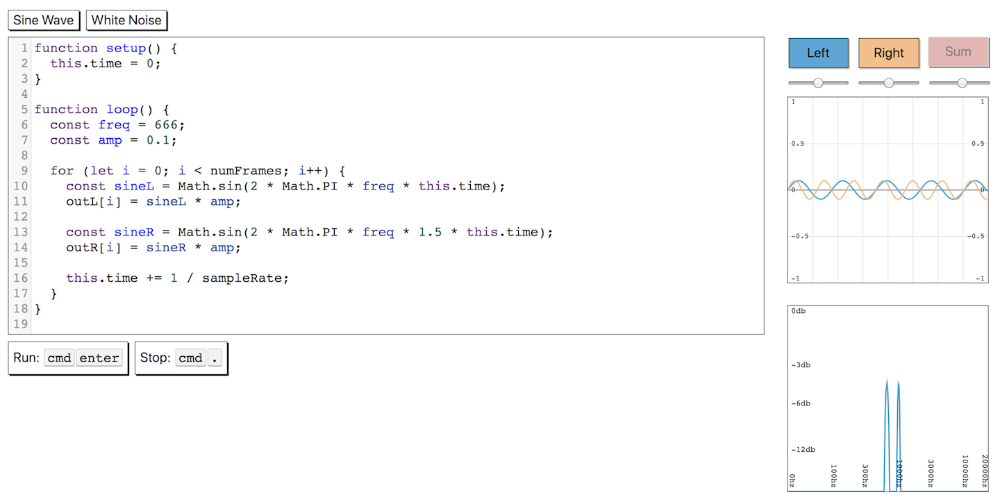

# Audio DSP Playground

A WebAudio API playground for DSP.

### [Demo](https://acarabott.github.io/audio-dsp-playground/)

This is a higher level version of my
[Audio Worklet Live Coding](https://github.com/acarabott/audio-worklet-live-coding/) demo, which exposes more of the guts of an Audio Worklet.

## Built with

- [CodeMirror](codemirror.net)
- [JSHint](http://jshint.com/)
- 🤟

## Authors

Arthur Carabott [arthurcarabott.com](http://arthurcarabott.com)

Stabilised Oscilloscope code adapted from <a href="https://codepen.io/ContemporaryInsanity/pen/Mwvqpb">Ewen</a>
